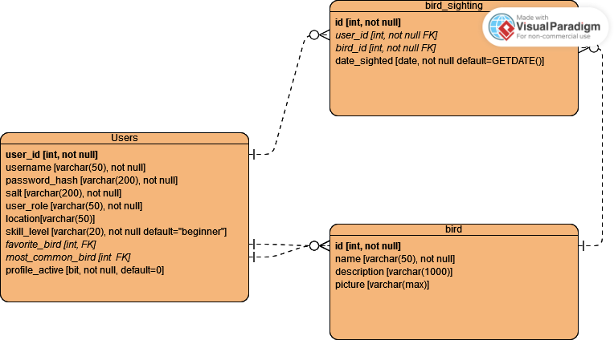
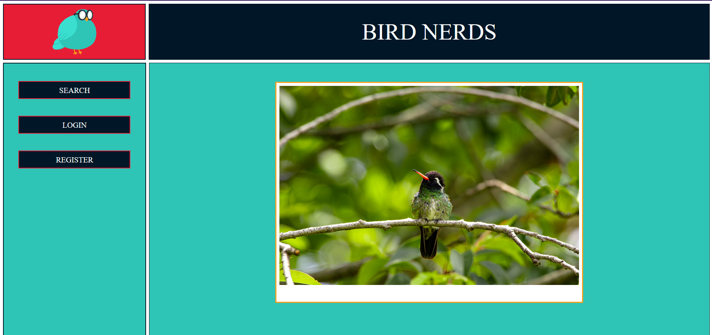
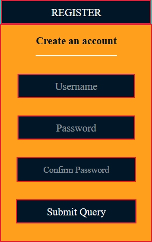
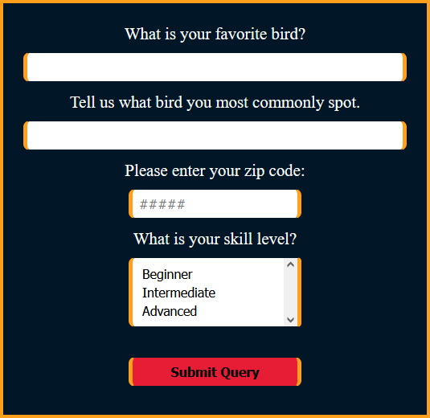

# Bird Nerds - WIP

Bird Nerds is a hobby web app that allows users to post about birds they have seen at their local bird feeder. Bird sightings that have been posted store the birds so that they may be found in a search by zipcode. Users can look back at their reported sightings by viewing their saved lists.

This project is built using C#/.NET and SQL Server for the back end API, and the Vue.js front end was provided as part of a Tech Elevator alumni project. In general, the front end has been left untouched in style, though minor structural edits may be made to adapt to the format of the back end API. Project partner:
- [kimbambala](https://github.com/kimbambala)

## Schema - WIP
The diagram below describes the database schema.



## API Routes
The following actions are available using the API:

| HTTP Method | Endpoint URL[^1] | Description | Status code | Returned Value |
| :---: | :---: | :--- | :---: | :--- | 
|**POST**|'/register'| Register a new user. | 201 | ``` { "userId", "username", "role" } ``` |
|||| 409, 500 | ``` { "message" } ``` |
|**POST**|'/login'| Request a JWT for authorization. | 200 | ``` { user: { "userId", "username", "role" }, "token" }``` |
|||| 409, 500 | ``` { "message" } ``` |
|**GET**|'/profile'| Request the current user's profile information. | 200 | ``` { "zipcode", "skillLevel", "favoriteBird", "mostCommonBird", "profileActive" } ``` |
|||| 404 | ``` { "message" } ``` |
|**POST**|'/createProfile'| Create a profile for the current user based on a JSON object in the body. Also reactivates a deleted profile. | 201 | ``` { "zipcode", "skillLevel", "favoriteBird", "mostCommonBird", "profileActive" } ``` |
|**PUT**|'/editProfile'| Updates a profile for the current user based on a JSON object in the body.| 200 |  |
|**DELETE**|'/deleteProfile'| Deactivates a profile for the current user. | 204 |  |
|||| 404 | ``` { "message" } ``` |
|**GET**|'/birds'| Get an array of all birds available in the database as JSON objects. | N/A[^2] | ```[ { "id", "name", "description", "imgUrl" }, ... ]``` |
|||| | ``` [] ``` |
|**GET**|'/birds/{id}'| Request a bird JSON object with a specific ID. | N/A[^2] | ``` { "id", "name", "description", "imgUrl" } ``` |
|**GET**|'/randomBird'| Request a random bird JSON object. | N/A[^2] | ``` { "id", "name", "description", "imgUrl" } ``` |
|**POST**|'/birds'| Create a bird from a JSON object in the body. | N/A[^2] | |
|**PUT**|'/birds/{id}'| Update a bird from a JSON object in the body. | N/A[^2] |  |
|**DELETE**|'/bird/{id}'| Delete a bird from the database with a specific ID. | N/A[^2] |  |

[^1]: Endpoint URLs were chosen to match Vue frontend supplied by Tech Elevator.
[^2]: Bird related actions currently return no status codes

## Profile creation
An anonymous user arrives at the landing page as shown below:



The landing page displays a random image of a bird that has been stored in the database.

The user creates their account with the form that appears after selecting the REGISTER button in the navigation bar on the left. This automatically creates an empty profile that the user can customize.



After logging in, the user can navigate to their profile using the new button in the navigation bar.


When profiles are created, a skill level of 'beginner' is automatically assigned. A user can update their favorite bird, their most commonly spotted bird, their zip code, and their skill level at any time.



## Building a List and Reporting a Bird
WIP - this section is currently being constructed.
